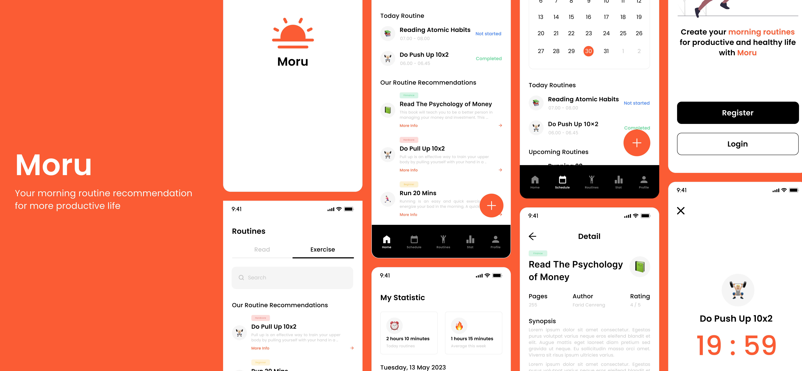
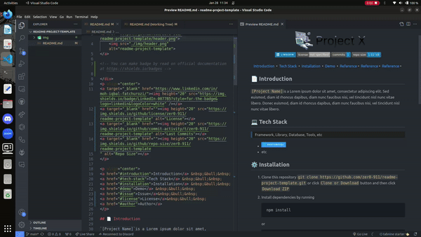

<!-- git remote add origin https|ssh:path/to/the/repository.git  -->
<!-- git pull origin main --rebase -->
<h1> Moru - Your Morning Routine App </h1>

<!-- You can make badge by read on official documentation at https://shields.io/badges -->

<!-- 

 -->

<a href="#-introduction">Introduction</a> &nbsp;&bull;&nbsp;
<a href="#-tech-stack">Tech Stack</a> &nbsp;&bull;&nbsp;
<a href="#%EF%B8%8F-installation">Installation</a> &nbsp;&bull;&nbsp;
<!-- <a href="#%EF%B8%8F-demo">Demo</a> &nbsp;&bull;&nbsp; -->
<a href="#-reference">Reference</a>&nbsp;&bull;&nbsp;
<a href="#-issue">Issue</a>&nbsp;&bull;&nbsp;
<a href="#-license">License</a>&nbsp;&bull;&nbsp;
<a href="#-author">I Putu Krisna Erlangga</a>

## 📄 Introduction

BMC Public Health states that consistency in morning routines, such as reading and exercising, can improve physical and mental health. Morning routines can also enhance productivity and performance at work. However, maintaining a morning routine is challenging for many people due to the required consistency.

To address this, my team and I developed `Moru`, an application designed to help users cultivate and maintain consistent morning routines. The app offers features such as exercise and book recommendations based on user preferences, routine management, and morning routine alarms. With a minimalist interface, the application provides a good user experience, making it easy for users to organize and execute their morning routines consistently and on schedule. Moru offers a variety of book options (sourced from the Google Books API) and exercise tutorials (in the form of video tutorials).

## 💻 Tech Stack

> Framework, Library, Database, Tools, etc

<!-- You can search the logo with https://simpleicons.org and copy the name in logo=copyhere same with color after badge/YourText-YourColor-->

- Kotlin
- Android Studio
- Postman
- Rertrofit
- Hilt
- DataStore
- AlarmManager

## ⚙️ Installation

1. Clone this repository `https://github.com/MornMon-Bangkit-Capstone/moru-app` or click `Clone or Download` button and then click `Download ZIP`
2. Open this project in Android Studio
3. Make sure your Android Virtual Device (AVD) is already activated
4. Run the app

<!-- ## 📽️ Demo

<!-- If Needed  -->
<!-- 

    

 -->

## 📚 Reference

<!-- If Needed -->

- [Google](https://www.google.com)

## 🚩 Issue

If you found a bug or an issue, please report by opening a new issue on [this repository](https://github.com/MornMon-Bangkit-Capstone/moru-app/issues).

## 📝 License

This project is licensed under the **MIT** License - see the [LICENSE](LICENSE) file for details

## 📌 Authors

<h3> I Putu Krisna Erlangga </h3>

